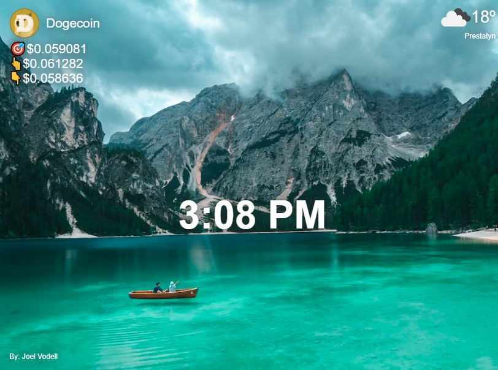

## Project Dashboard

Welcome to our project's dashboard! Here's a glimpse of what it looks like:

This dashboard provides an overview of our project's key features and data. Feel free to explore and get a sense of what our project has to offer.

### Getting Started

To use our Chrome extension, follow these quick steps:

1. Open Google Chrome.
2. Navigate to `chrome://extensions/` in your browser.
3. Enable the "Developer mode" option in the top-right corner.
4. Click on the "Load unpacked" button.
5. Select the extension directory from your local files.
6. Our extension should now be installed and active.

Enjoy using our Chrome extension and exploring the project dashboard!

## Explore Public APIs

Looking for more public APIs to integrate into your projects? Check out this gigantic list of public APIs for inspiration:

[Public APIs](https://github.com/public-apis/public-apis)

This curated collection offers a wide range of APIs across various categories, making it a valuable resource for developers seeking data and services to enhance their applications.
